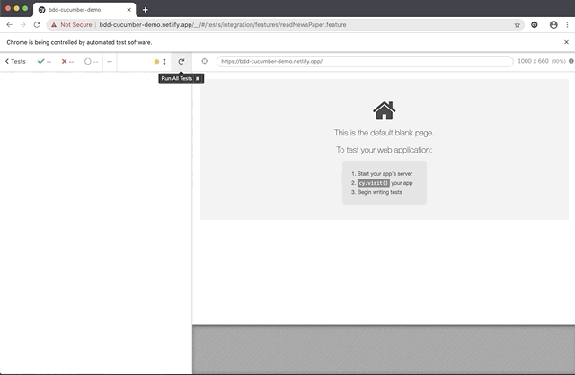

# BDD Cucumber demo [](https://circleci.com/gh/anilkk/bdd-cucumber-demo/tree/master.svg?style=svg)

It's demo application to demonstrate **Behavior Driven Development** using [Cucumber](https://cucumber.io/). Test scenarios from the perspective of **user** and **outside-in approach**. [Demo BDD Cucumber site](https://bdd-cucumber-demo.netlify.app/).

E2E automation tests are written using [Cypress](https://www.cypress.io/) and executed on [CircleCI](https://circleci.com/).



## [Gherkins](https://cucumber.io/docs/gherkin/)

```gherkin
  Feature: Read the book
  
  As Maria, I need a good light in order to read the book
  
  Scenario: Maria should be able to read the book during the day without room light
    Given Maria is at her home
      And it's a morning
      And lamp light is off
     Then she should be able to read the book
  
  Scenario: Maria should be able to read the book during the day with room light on
    Given Maria is at her home
      And it's a morning
      And lamp light is on
     Then she should be able to read the book 
  
  Scenario: Maria should not be able to read the book during the night
    Given Maria is at her home
      And it's a night
      And lamp light is off
     Then she should not be able to read the book
  
  Scenario: Maria should be able to read book during the night
    Given Maria is at her home
      And it's a night
      And lamp light is off
     When she switch on the light
     Then she should be able to read the book

  Scenario Outline: Maria should be able to read book during the night with light color <light_color>
    Given Maria is at her home
      And it's a night
      And lamp light is off
    When she switch on the light with <light_color>
    Then she should be able to read the book

    Examples: 
      | light_color | 
      | yellow      | 
      | red         | 
      | orange      | 
```

## How to run Cypress e2e test locally

1. Instal node module dependencies 
```shell
npm intall
```

2. Run Cypress

```shell
npm run cypress-run
```

or if you want run with Cypress interactive window

```shell
npm run cypress-open
```
